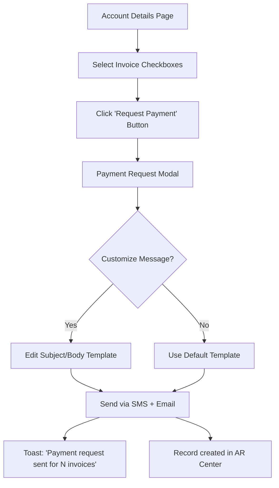
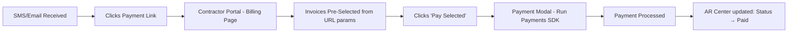
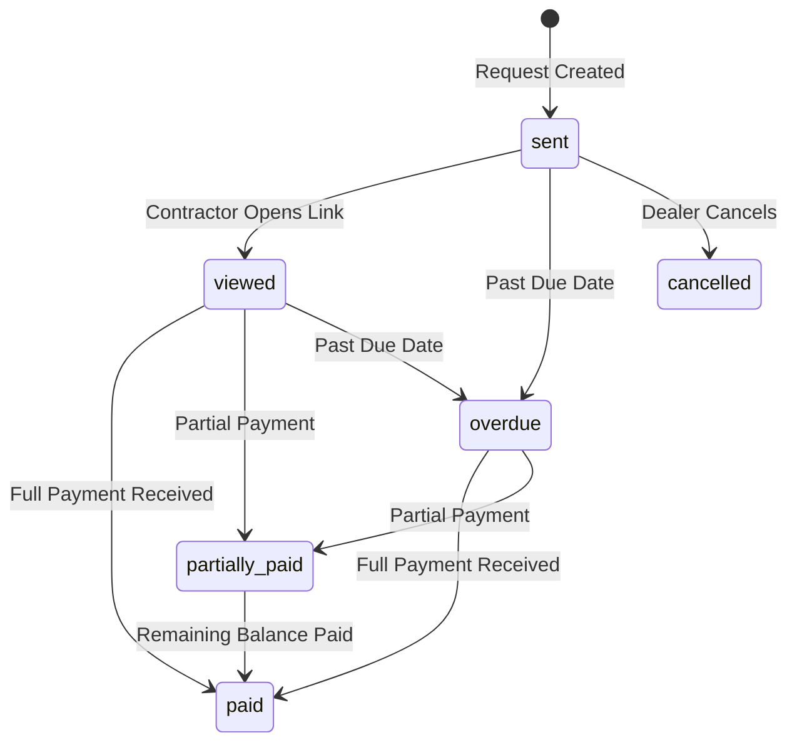
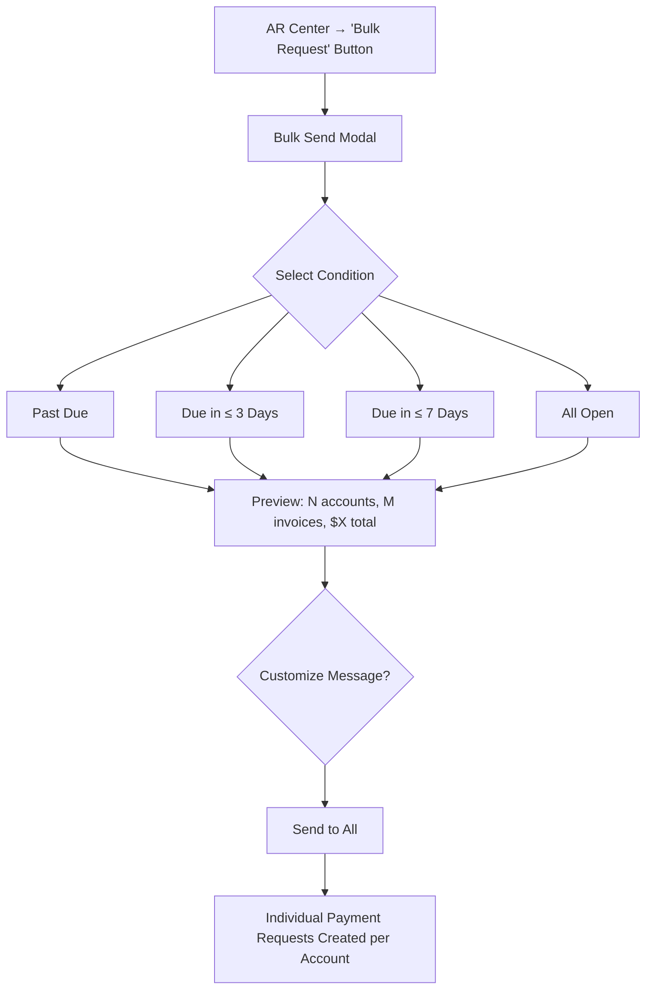
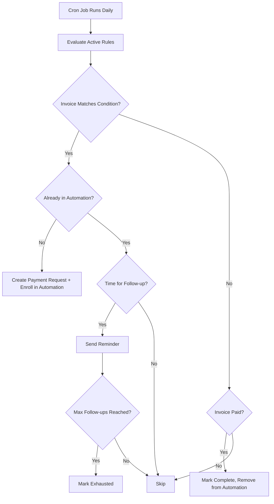

# AR Center — Product Requirements Document

**Status:** Draft — Awaiting Review  
**Project:** Velocity (Dealer Admin Portal + Contractor Portal)  
**Created:** February 16, 2026  

---

## 1. Executive Summary

The **AR Center** transforms Velocity from a passive account-viewing tool into an active collections management platform. Dealer admin users gain the ability to send payment request links directly to contractors, track collection status, and automate follow-up workflows for past-due accounts — all from a dedicated hub in the admin portal.

On the contractor side, the existing billing experience is enhanced to support paying **multiple selected invoices** in a single transaction, enabling seamless fulfillment of payment requests received via SMS or email.

### 1.1 Key Objectives

| # | Objective | Value |
|---|-----------|-------|
| 1 | **Request-to-Pay Links** | Dealer sends a link via SMS + email → contractor lands directly on their billing page with the requested invoices pre-selected |
| 2 | **Multi-Invoice Payment** | Contractors can select and pay multiple invoices at once (currently only single invoice payment exists) |
| 3 | **Collection Tracking** | Central AR dashboard showing all outbound payment requests, their status, and one-click reminder capability |
| 4 | **Bulk Requests & Automations** | Mass-send payment requests across accounts; schedule recurring follow-ups until invoices are paid |

---

## 2. User Roles & Permissions

| Role | AR Center Access | Can Send Requests | Can Setup Automations |
|------|-----------------|-------------------|----------------------|
| `tenant_owner` | Full | ✅ | ✅ |
| `tenant_staff` | Full | ✅ | ✅ |
| `account_admin` | N/A (contractor-side) | — | — |
| `account_user` | N/A (contractor-side) | — | — |

> [!NOTE]
> Only dealer-side admin roles (`tenant_owner`, `tenant_staff`) have access to the AR Center. Contractor-side users (`account_admin`, `account_user`) interact with payment requests via the contractor portal billing page.

---

## 3. Feature 1: Payment Request Links (Account Detail → Contractor Portal)

### 3.1 User Story

> **As a** dealer admin viewing an account's open invoices,  
> **I want to** select one or more invoices and send a "request payment" link via SMS and email,  
> **So that** the contractor receives a friendly reminder with a direct link to pay those specific invoices.

### 3.2 UX Flow — Dealer Admin (Sender)



#### Modal Details (Replacing the "Coming Soon" Modal)

The existing modal in [page-account-details.ts](file:///home/colton/Desktop/BuilderWire_HQ/Velocity/velocity-frontend/src/admin/pages/page-account-details.ts#L725-L748) will be upgraded to a functional form:

| Field | Type | Required | Default |
|-------|------|----------|---------|
| Delivery Method | Checkbox group (SMS, Email) | At least one | Both checked |
| Recipient Phone | Pre-filled from account | If SMS selected | `account.phone` |
| Recipient Email | Pre-filled from account | If Email selected | `account.email` |
| Message Subject | Text input | If Email | "Payment Requested — Invoice(s) Due" |
| Message Body | Textarea with template variables | Yes | See template below |
| Selected Invoices | Read-only summary | — | Auto from selection |

#### Default Message Template

```
Hi {contactName},

Your invoice(s) {invoiceNumbers} totaling {totalAmount} are due on {earliestDueDate}.

Click below to view and pay:
{paymentLink}

Thank you,
{dealerName}
```

### 3.3 UX Flow — Contractor (Recipient)



#### Deep Link URL Structure

```
https://{tenant-slug}.velocity.app/billing?pr={paymentRequestId}&invoices={inv1,inv2,inv3}
```

- The `pr` param tracks which payment request was fulfilled
- The `invoices` param pre-selects the specified invoices on page load
- Authentication is still required — if not logged in, the user hits the login page first, then is redirected

### 3.4 Acceptance Criteria

- [ ] Dealer admin can send payment request for 1+ selected invoices
- [ ] SMS is delivered via existing Messaging Service infrastructure
- [ ] Email is delivered via backend email service
- [ ] Contractor receives link that opens billing page with invoices pre-selected
- [ ] Payment request record is created and visible in AR Center
- [ ] Message includes invoice numbers, due dates, and total amount due
- [ ] Validation: at least one delivery method, valid phone/email

---

## 4. Feature 2: Multi-Invoice Payment (Contractor Portal)

### 4.1 User Story

> **As a** contractor viewing my invoices on the billing page,  
> **I want to** select multiple open invoices and pay them all at once,  
> **So that** I can settle my account balance quickly, especially when prompted by a payment request.

### 4.2 Current State vs. Target State

| Aspect | Current | Target |
|--------|---------|--------|
| Invoice selection | None (click to view details) | Checkbox per invoice row |
| Payment action | "Pay Now" on individual invoice detail | "Pay Selected (N)" bulk action bar |
| Payment modal | Single invoice amount | Summed total of selected invoices |
| PaymentPayload | Single allocation | Array of `PaymentAllocation[]` |
| Deep link support | None | `?invoices=1,2,3` pre-selects |

### 4.3 Technical Details

The existing [PaymentPayload](file:///home/colton/Desktop/BuilderWire_HQ/Velocity/velocity-frontend/src/connect/types/domain.ts#L443-L451) type already supports `allocations: PaymentAllocation[]`, so the backend `POST /v1/payments` endpoint should already work with multi-invoice allocations. The frontend change is primarily UI — adding checkboxes to the invoice list and summing amounts.

The existing [pv-payment-modal.ts](file:///home/colton/Desktop/BuilderWire_HQ/Velocity/velocity-frontend/src/features/billing/components/pv-payment-modal.ts) currently accepts `invoiceId` and `amount` props. It needs to be refactored to accept `invoices: { id: number, amount: number }[]` and display the line-item breakdown.

### 4.4 Acceptance Criteria

- [ ] Invoice list shows checkbox per open invoice
- [ ] "Select All" checkbox in header
- [ ] Floating action bar appears when ≥1 invoice selected showing count and total
- [ ] "Pay Selected" button opens payment modal with summed amount
- [ ] Payment modal displays breakdown of each selected invoice
- [ ] Payment processes against all selected invoices via `allocations[]`
- [ ] URL query params `?invoices=1,2,3` pre-select invoices on page load
- [ ] URL query param `?pr={id}` marks payment request as fulfilled on successful payment

---

## 5. Feature 3: AR Center Dashboard

### 5.1 User Story

> **As a** dealer admin,  
> **I want to** see a centralized view of all payment requests I've sent,  
> **So that** I can track which invoices have been paid and which need follow-up.

### 5.2 Dashboard Layout

The [page-ar-center.ts](file:///home/colton/Desktop/BuilderWire_HQ/Velocity/velocity-frontend/src/admin/pages/page-ar-center.ts) placeholder will be replaced with a full dashboard:

#### Summary Cards (Top Row)

| Card | Metric | Color |
|------|--------|-------|
| **Total Outstanding** | Sum of all unpaid requested amounts | Blue |
| **Open Requests** | Count of requests with `status = 'sent'` | Orange |
| **Paid This Month** | Sum of paid requests in current month | Green |
| **Overdue** | Count of requests past due date with `status != 'paid'` | Red |

#### Payment Requests Table

| Column | Description |
|--------|-------------|
| Account Name | Linked to account details |
| Invoice(s) | List of invoice numbers |
| Amount | Total requested amount |
| Sent Date | When the request was created |
| Due Date | Earliest due date of included invoices |
| Status | `Sent` · `Viewed` · `Paid` · `Partially Paid` · `Overdue` |
| Actions | Send Reminder · View Details |

#### Filters & Search

- Status filter (multi-select dropdown)
- Date range filter
- Account search (typeahead)
- Sort by: Sent Date, Due Date, Amount, Status

### 5.3 Payment Request Status Lifecycle



### 5.4 Send Reminder Action

Clicking "Send Reminder" on a request row re-sends the same SMS + email notification with an updated message:

```
Hi {contactName},

This is a friendly reminder that your invoice(s) {invoiceNumbers} 
totaling {remainingBalance} are still outstanding.

Click below to view and pay:
{paymentLink}

Thank you,
{dealerName}
```

- Reminder count is tracked per request
- Reminder timestamps are logged

### 5.5 Acceptance Criteria

- [ ] AR Center displays summary cards with real-time metrics
- [ ] Payment requests table with pagination, filtering, and sorting
- [ ] Status badges with color coding
- [ ] "Send Reminder" action re-sends notification
- [ ] Clicking account name navigates to account details
- [ ] Clicking invoice numbers navigates to invoice details
- [ ] Reminder count visible per request

---

## 6. Feature 4: Bulk Requests & Automated Collections

### 6.1 User Story — Bulk Requests

> **As a** dealer admin,  
> **I want to** send payment requests to all accounts with past-due invoices at once,  
> **So that** I can efficiently manage collections across my entire customer base.

### 6.2 User Story — Automations

> **As a** dealer admin,  
> **I want to** set up automated rules that send payment requests and follow-ups,  
> **So that** collections happen without manual intervention.

### 6.3 Bulk Send Flow



#### Bulk Send Preview Table

| Column | Description |
|--------|-------------|
| Account | Account name |
| Invoice Count | Number of matching invoices |
| Total Amount | Sum of matching invoice balances |
| Contact | Primary contact email + phone |
| ☐ Include | Deselect to exclude |

### 6.4 Automation Rules

#### Rule Configuration

| Field | Type | Options |
|-------|------|---------|
| **Rule Name** | Text | User-defined |
| **Trigger Condition** | Select | Past due · Due in ≤ 3 days · Due in ≤ 7 days · Due today |
| **Initial Action** | Fixed | Send payment request (SMS + Email) |
| **Follow-up Interval** | Number + Unit | e.g., "Every 3 days" |
| **Max Follow-ups** | Number | e.g., 5 (then stop) |
| **Message Template** | Textarea | Default provided, customizable |
| **Active** | Toggle | On/Off |

#### Automation Execution Flow



### 6.5 Automations Dashboard (Sub-tab within AR Center)

| Column | Description |
|--------|-------------|
| Rule Name | User-defined name |
| Condition | Past due, due in ≤3 days, etc. |
| Active Invoices | Count of invoices currently enrolled |
| Total Sent | Total requests + reminders sent |
| Collected | Amount collected via this automation |
| Status | Active · Paused |
| Actions | Edit · Pause/Resume · Delete |

### 6.6 Acceptance Criteria

- [ ] Bulk send modal with condition selector and preview table
- [ ] Preview shows matching accounts/invoices before sending
- [ ] Ability to deselect individual accounts from bulk send
- [ ] Custom message template for bulk sends
- [ ] Automation rule CRUD (create, read, update, delete)
- [ ] Automation rules execute on a daily schedule
- [ ] Follow-up reminders sent at configured intervals
- [ ] Invoices automatically removed from automation when paid
- [ ] Max follow-up limit prevents infinite sends
- [ ] Automation dashboard showing rule performance metrics

---

## 7. Data Model — Payment Request

### 7.1 `payment_requests` Table

| Column | Type | Description |
|--------|------|-------------|
| `id` | `bigserial` | Primary key |
| `tenant_id` | `uuid` | FK → tenants |
| `account_id` | `bigint` | FK → accounts |
| `created_by_user_id` | `bigint` | FK → users (dealer admin) |
| `status` | `varchar(20)` | `sent` · `viewed` · `paid` · `partially_paid` · `overdue` · `cancelled` |
| `total_amount` | `decimal(15,2)` | Sum of all invoice balances at time of request |
| `remaining_amount` | `decimal(15,2)` | Remaining unpaid amount |
| `message_subject` | `text` | Email subject |
| `message_body` | `text` | Message body (SMS + email) |
| `delivery_sms` | `boolean` | Whether SMS was sent |
| `delivery_email` | `boolean` | Whether email was sent |
| `recipient_phone` | `varchar(20)` | Target phone number |
| `recipient_email` | `varchar(255)` | Target email address |
| `reminder_count` | `int` | Number of reminders sent |
| `last_reminder_at` | `timestamptz` | When last reminder was sent |
| `viewed_at` | `timestamptz` | When contractor first opened the link |
| `paid_at` | `timestamptz` | When fully paid |
| `automation_rule_id` | `bigint` | FK → automation_rules (nullable) |
| `created_at` | `timestamptz` | Record creation |
| `updated_at` | `timestamptz` | Last update |

### 7.2 `payment_request_invoices` Junction Table

| Column | Type | Description |
|--------|------|-------------|
| `id` | `bigserial` | Primary key |
| `payment_request_id` | `bigint` | FK → payment_requests |
| `invoice_id` | `bigint` | FK → invoices |
| `invoice_number` | `varchar(50)` | Denormalized for display |
| `amount_at_request` | `decimal(15,2)` | Balance at time of request |
| `amount_paid` | `decimal(15,2)` | Amount paid so far (default 0) |

### 7.3 `automation_rules` Table

| Column | Type | Description |
|--------|------|-------------|
| `id` | `bigserial` | Primary key |
| `tenant_id` | `uuid` | FK → tenants |
| `name` | `varchar(100)` | User-defined rule name |
| `condition` | `varchar(30)` | `past_due` · `due_in_3_days` · `due_in_7_days` · `due_today` |
| `message_template` | `text` | Customizable message body |
| `follow_up_interval_days` | `int` | Days between follow-ups |
| `max_follow_ups` | `int` | Maximum reminders per invoice |
| `is_active` | `boolean` | Whether rule is active |
| `created_by_user_id` | `bigint` | FK → users |
| `created_at` | `timestamptz` | Record creation |
| `updated_at` | `timestamptz` | Last update |

### 7.4 `automation_enrollments` Table

| Column | Type | Description |
|--------|------|-------------|
| `id` | `bigserial` | Primary key |
| `automation_rule_id` | `bigint` | FK → automation_rules |
| `payment_request_id` | `bigint` | FK → payment_requests |
| `invoice_id` | `bigint` | FK → invoices |
| `follow_up_count` | `int` | Reminders sent so far |
| `next_follow_up_at` | `timestamptz` | When next reminder is due |
| `status` | `varchar(20)` | `active` · `completed` · `exhausted` |
| `created_at` | `timestamptz` | Enrollment time |
| `completed_at` | `timestamptz` | When invoice paid / automation ended |

---

## 8. API Endpoints (Backend)

### 8.1 Payment Request Endpoints

| Endpoint | Method | Description |
|----------|--------|-------------|
| `POST /v1/admin/payment-requests` | POST | Create a payment request |
| `GET /v1/admin/payment-requests` | GET | List all payment requests (paginated + filtered) |
| `GET /v1/admin/payment-requests/{id}` | GET | Get a single payment request detail |
| `POST /v1/admin/payment-requests/{id}/remind` | POST | Send a reminder for a request |
| `PUT /v1/admin/payment-requests/{id}/cancel` | PUT | Cancel a payment request |
| `POST /v1/admin/payment-requests/bulk` | POST | Bulk create payment requests |
| `GET /v1/admin/payment-requests/summary` | GET | Get AR summary metrics |

### 8.2 Automation Endpoints

| Endpoint | Method | Description |
|----------|--------|-------------|
| `POST /v1/admin/automations` | POST | Create an automation rule |
| `GET /v1/admin/automations` | GET | List all automation rules |
| `PUT /v1/admin/automations/{id}` | PUT | Update an automation rule |
| `DELETE /v1/admin/automations/{id}` | DELETE | Delete an automation rule |
| `PUT /v1/admin/automations/{id}/toggle` | PUT | Activate/deactivate a rule |
| `GET /v1/admin/automations/{id}/enrollments` | GET | List invoices enrolled in a rule |

### 8.3 Contractor Portal — Payment Request Resolution

| Endpoint | Method | Description |
|----------|--------|-------------|
| `GET /v1/payment-requests/{id}` | GET | Contractor fetches request details (returns invoice list) |
| `POST /v1/payment-requests/{id}/viewed` | POST | Mark request as viewed (called when page loads) |

> [!IMPORTANT]
> The existing `POST /v1/payments` endpoint already supports `allocations[]` and does **not** need modification. When a payment is created against invoices tied to a payment request, a webhook/event should update the payment request status.

---

## 9. Integration Points

### 9.1 Messaging Service (Existing)

SMS delivery will leverage the existing messaging infrastructure in [communication.go](file:///home/colton/Desktop/BuilderWire_HQ/Velocity/velocity-backend/internal/domain/communication.go). The backend messaging service already supports outbound SMS via the provider integration used by the [admin messaging page](file:///home/colton/Desktop/BuilderWire_HQ/Velocity/velocity-frontend/src/admin/pages/page-messaging.ts).

### 9.2 Email Service (New)

A transactional email service is needed for email delivery. This should use a provider like SendGrid, Postmark, or AWS SES. The emails should be:
- Branded with the dealer's logo/name
- Mobile-responsive HTML templates
- Include unsubscribe links for compliance

### 9.3 Payment Gateway (Existing)

The [Run Payments SDK](file:///home/colton/Desktop/BuilderWire_HQ/Velocity/velocity-frontend/src/connect/services/payment-sdk.ts) is already integrated. No changes needed to the payment processing pipeline — only the frontend UI to support multi-invoice selection.

### 9.4 ERP Sync (Existing)

When payments are received, the existing ERP sync pipeline (Spruce/DMSI adapters) handles posting back to the ERP. No changes needed.

---

## 10. Implementation Priority & Phasing

### Phase 1: Foundation (Sprint A)
- Multi-invoice selection in contractor portal
- Payment request creation from account details page
- SMS + email delivery of payment links
- Deep link handling in contractor portal

### Phase 2: AR Dashboard (Sprint B)  
- AR Center dashboard with summary cards
- Payment request tracking table
- Send reminder functionality
- Payment request status lifecycle

### Phase 3: Bulk & Automations (Sprint C)
- Bulk send modal with condition filtering
- Automation rule CRUD
- Daily automation job execution
- Automation dashboard

---

## 11. Success Metrics

| Metric | Target | Measurement |
|--------|--------|-------------|
| **Payment request → paid conversion** | >40% within 7 days | Payment request status transitions |
| **Days Sales Outstanding (DSO) reduction** | 15% improvement | Average DSO before/after |
| **Manual collections effort** | 50% reduction | Time spent on AR tasks (survey) |
| **Automation adoption** | >60% of active dealers | Dealers with ≥1 active automation |

---

## User Review Required

> [!IMPORTANT]
> **Email Service Provider**: The backend currently has SMS messaging infrastructure but no transactional email service. Which provider should the backend team integrate? (SendGrid, Postmark, AWS SES, or other?)

> [!IMPORTANT]
> **Authentication for Deep Links**: When a contractor clicks a payment link, should they be required to log in first, or should we support a tokenized/magic-link approach for one-click access?

> [!WARNING]
> **Phasing Decision**: Features 1–3 are foundational and should be built sequentially. Feature 4 (bulk + automations) is significantly more complex and could be deferred to a follow-up release. Confirm if all 4 features should be planned in the initial sprints.
