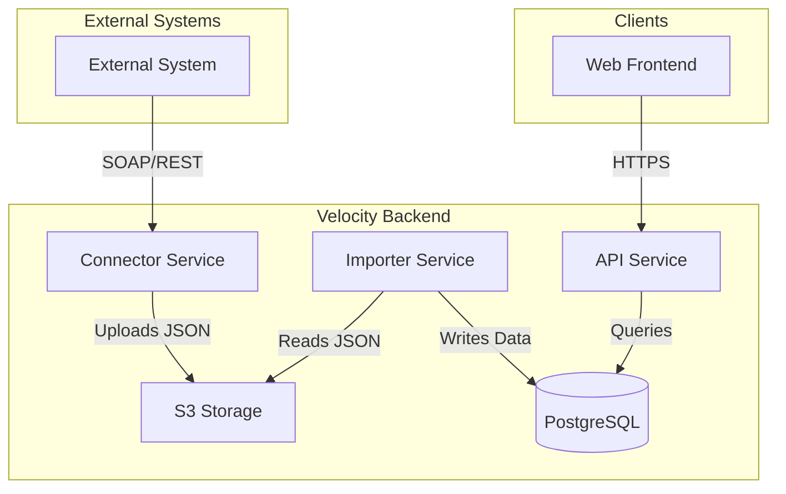

# System Architecture

## Overview

Velocity is a multi-tenant B2B platform designed for the Lumber and Building Materials (LBM) industry. The system synchronizes data from an external system (e.g. an ERP) into a local PostgreSQL database and provides a modern REST API for frontend applications.

## High-Level Diagram

## Component Roles

### 1. Connector Service (`cmd/connector`)
The Connector is responsible for periodic data extraction from BisTrack. It fetches resources like customers, invoices, and product catalogs, transforms them into standardized JSON format, and uploads them to S3 storage.

### 2. Importer Service (`cmd/importer`)
The Importer watches for new data in S3 or is triggered by the Connector. It processes the JSON files and performs high-performance bulk inserts or updates into the PostgreSQL database, ensuring data consistency across tenants.

### 3. API Service (`cmd/api`)
The API provides a RESTful interface for external clients. It is built using [Huma](https://huma.rocks/) and standard Go `net/http`. It handles authentication, tenancy, and serves data from the PostgreSQL database.

### 4. Database (`docs/db.sql`)
A PostgreSQL database organized into several schemas:
- `auth`: API keys, sessions, and user management.
- `core`: The primary domain data (Accounts, Invoices, Orders, Products).
- `integrations`: Tracking sync status and external system mappings.

## Multi-Tenancy

Velocity uses a **hybrid multi-tenancy** strategy to balance isolation and scalability:

1.  **Physical Isolation (Tenant Level)**: Every primary tenant (e.g., an LBM Dealer) is assigned its own dedicated PostgreSQL database. This is managed by a **Control Plane** which maps tenant slugs to specific database connection strings. The API uses this mapping to route requests to the correct physical database.
2.  **Logical Isolation (Account Level)**: Within a tenant's database, multiple customer **Accounts** (sub-entities of the tenant) co-exist. Every table in the `core` schema contains an `account_id` reference. The API enforces this logical isolation by scoping all SQL queries to the authenticated user's `account_id`, providing row-level security within the shared tenant database.

The middleware extracts the `X-Tenant-ID` (or subdomain) to determine the physical database and the user's session token to determine the logical `account_id` scope.
